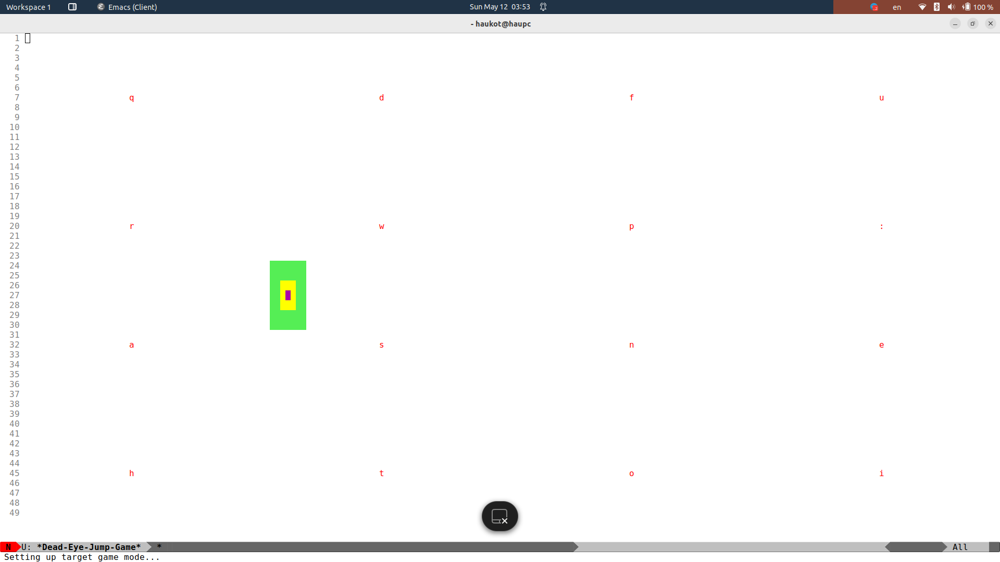

# Dead Eye Jump

This Emacs plugin is similar to Avy, Ace-Jump, or EasyMotion but introduces a mechanic from another angle—you're not going for a symbol, but for a place, selecting a location within the full frame based on the screen quadrant.
With just three keystrokes, you can move to (almost exactly) any desired location on the screen.
So one location will always correspond to the same keys, making with time navigating simpler as you could mechanically remember places.

# Usage

Add to config
```eslisp
(require 'dead-eye-jump)

;; optionally add your keys to navigate
;; (setq dead-eye-jump-keys '("q" "w"  "u" "i"
;;                            "e" "r"  "o" "p"
;;                            "a" "s"  "j" "k"
;;                            "d" "f"  "l" ";"))

;; add keybdinging
(global-set-key (kbd "C-j") 'dead-eye-jump)
```

`C-j <char> <char> <char>`

Examples:

`C-j`


Press `a`


Press `h`


Press `u`


# Training game

To test and play you could run simple shoot target game

```eslisp
(require 'dead-eye-jump-game)

;; and then run command dead-eye-jump-game
```



# Configuration

```eslisp
(defcustom dead-eye-jump-keys
  '("q" "w"  "u" "i"
    "e" "r"  "o" "p"
    "a" "s"  "j" "k"
    "d" "f"  "l" ";")
  "Keys to use for jump"
  :type 'list)

(defcustom dead-eye-jump-repeats 3
  "Number of times to repeat the jump."
  :type 'integer)

(defcustom dead-eye-jump-columns 4
  "Number of columns to divide the frame into."
  :type 'integer)

(defcustom dead-eye-jump-rows 4
  "Number of rows to divide the frame into."
  :type 'integer)

(defcustom dead-eye-jump-background t
  "When non-nil, a gray background will be added during the selection."
  :type 'boolean)

(defvar dead-eye-jump--overlays-lead nil
  "Hold overlays for leading chars.")

(defvar dead-eye-jump--overlays-back nil
  "Hold overlays for when `dead-eye-jump-background' is t.")

(defface dead-eye-jump-background-face
  '((t (:foreground "gray40")))
  "Face for whole window background during selection.")
```

# TODO

* Should not count height and width of bars, modelines and so on?
* Make command to stop in middle of seeking(e.g. if first char already on right spot)
* Overlays should be placed in empty places also, padding them with characters. This is because the quadrants should always be clearly visible, otherwise it's unclear where it will send since the point is not in the center.

# Similar packages

* https://github.com/abo-abo/avy
* https://github.com/winterTTr/ace-jump-mode
