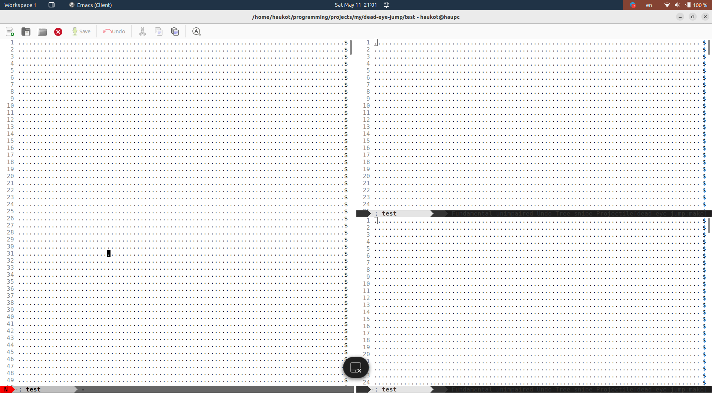

# Dead Eye Jump

Emacs plugin like avy or ace-jump or EasyMotion, but with different mechanic - you select place in full frame based of quadrant of the screen.
So it'll move mechanic action without additional thinking - one place always will be the same keys.
And in 3 keys you could move(almost exactly) where you want on the screen.

# Usage

Add to config
```eslisp
;; your keys to navigate
(setq dead-eye-jump-keys '("q" "d" "r" "w" "a" "s" "h" "t" "f" "u" "p" ":" "n" "e" "o" "i"))
(global-set-key (kbd "C-j") 'dead-eye-jump)
```

`C-j <char> <char> <char>`

Examples (on Workman keyboard layout, you could set Querty keys):

`C-j`


Press `a`


Press `h`


Press `u`


# TODO

* Should not count height and width of bars, modelines and so on?
* Make command to stop in middle of seeking(e.g. if first char already on right spot)
* Overlays should be placed in empty places also, padding them with characters. This is because the quadrants should always be clearly visible, otherwise it's unclear where it will send since the point is not in the center.

# Similar packages

* https://github.com/abo-abo/avy
* https://github.com/winterTTr/ace-jump-mode
